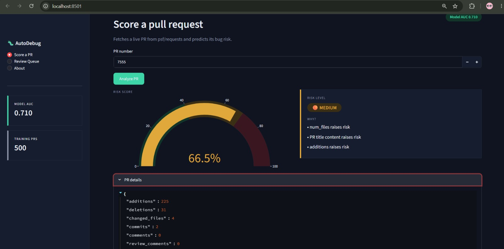
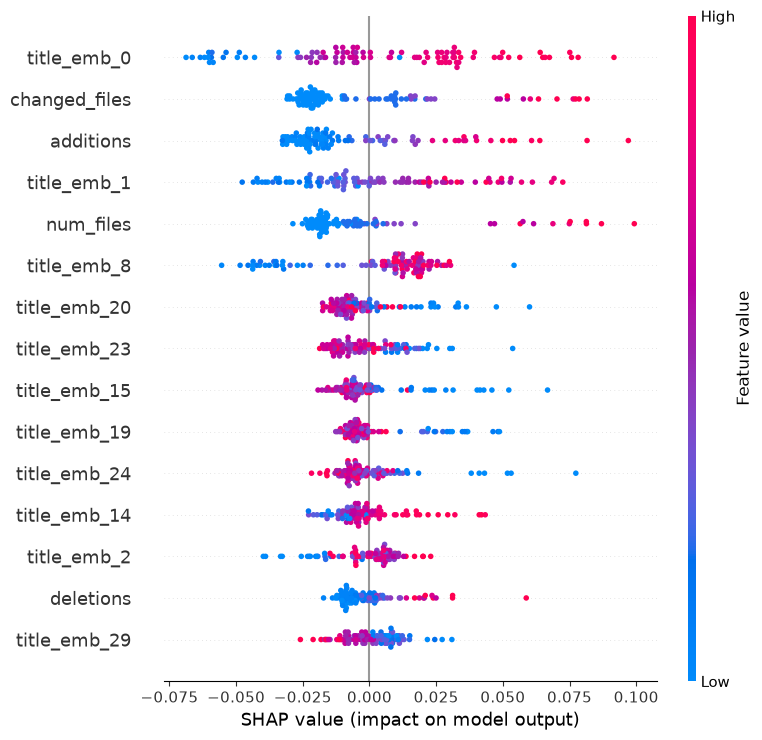

# AutoDebug AI

Predicts which GitHub pull requests are likely to introduce bugs, so reviewers know which ones need extra attention — a "credit score for code changes."

A full end-to-end ML system: data collection, automated labeling, model training, explainability, a REST API, and an interactive dashboard.

## How it works

1. **Collect data** — pulls 500 merged PRs and 2,000 commits from the `psf/requests` repo using the GitHub API
2. **Label them** — a PR is marked "buggy" if a bug-fix commit later changed the same files within 90 days of the merge
3. **Train a model** — predicts the bug risk of new PRs from features like size, files changed, and title text
4. **Serve it** — a FastAPI service and a Streamlit dashboard score any PR and explain why

Dataset: **201 buggy / 299 safe PRs (40% buggy)**

## Dashboard



```bash
streamlit run app/dashboard.py
```

Score any live PR from `psf/requests` by number, see its risk gauge and top reasons, and browse recent PRs in a review queue sorted riskiest-first.

## Results

Final feature set: 10 numeric features + PR title embeddings (`all-MiniLM-L6-v2`, compressed 384 → 30 dims with PCA).

| Model | AUC |
|---|---|
| **Random Forest** | **0.710** |
| Logistic Regression | 0.662 |
| XGBoost | 0.658 |
| LightGBM | 0.631 |

The winning Random Forest is saved to `models/best_model.pkl`.

Findings from the experiments along the way:

- **Author-history features didn't help** — 45% of PRs come from first-time contributors, so most authors have no usable history.
- **Full 384-dim title embeddings overfit** (394 features vs 400 training rows); PCA compression to 30 dims fixed it and produced the best result.
- **Gradient boosting underperformed** — expected with only 400 training rows, where lower-variance models generalize better.

## What drives risk?



PR size dominates: more changed files and added lines push risk up. Title embeddings carry surprising signal — the strongest single feature is a title dimension, meaning how a PR is described correlates with bug risk.

## API

```bash
uvicorn src.api:app --reload
```

Open http://127.0.0.1:8000/docs for interactive testing.

- `POST /predict` — score a PR from provided features
- `GET /predict/{pr_number}` — fetch a live PR from `psf/requests` and score it

Example — live scoring of a real PR:

```json
GET /predict/7555
{"risk_score": 0.665, "risk_level": "medium", "reasons": ["num_files raises risk", "PR title content raises risk", "additions raises risk"]}
```

## Run it yourself

```bash
pip install -r requirements.txt
```

Add a GitHub token to a `.env` file:

```
GITHUB_TOKEN=your_token_here
```

Build the dataset, then train:

```bash
python -m src.data.collect
python -m src.data.collect_commits
python -m src.data.label
python -m src.model.train      # trains the model (AUC ~0.71), saves to models/
```

Or run the API with Docker:

```bash
docker build -t autodebug-ai .
docker run -p 8000:8000 --env-file .env autodebug-ai
```

## Project structure

```
AutoDebugAI/
├── app/
│   └── dashboard.py             # Streamlit dashboard
├── data/                        # raw JSON + labeled CSVs (gitignored)
│   ├── raw/
│   └── processed/
├── docs/                        # images for the README
│   ├── dashboard.png
│   └── output.png               # SHAP summary plot
├── models/
│   ├── best_model.pkl           # trained Random Forest
│   └── pca.pkl                  # PCA transformer for serving
├── notebooks/                   # experiments: baseline → features → NLP → shootout → SHAP
├── src/
│   ├── data/                    # data collection & labeling
│   │   ├── collect.py           # fetch merged PRs
│   │   ├── collect_commits.py   # fetch commits
│   │   ├── label.py             # create labeled dataset
│   │   └── fetch_pr.py          # fetch a live PR's features
│   ├── model/                   # ML lifecycle
│   │   ├── features.py          # build feature matrix (numeric + PCA embeddings)
│   │   ├── train.py             # train Random Forest, save model
│   │   └── predict.py           # score a PR: risk + reasons
│   └── api.py                   # FastAPI service
├── Dockerfile
├── requirements.txt
└── README.md
```

## Limitations

Labels are approximate — bug-fix matching is at file level, not line level (a simplified SZZ approach), so some labels are noisy. This caps achievable accuracy (~0.71 AUC across all models tested), and is documented honestly rather than hidden. The natural production form would be a GitHub Action that calls this API on each new PR and posts the risk as a review comment.

## Tech

Python · PyGithub · pandas · scikit-learn · sentence-transformers · XGBoost · LightGBM · SHAP · FastAPI · Streamlit · Docker
